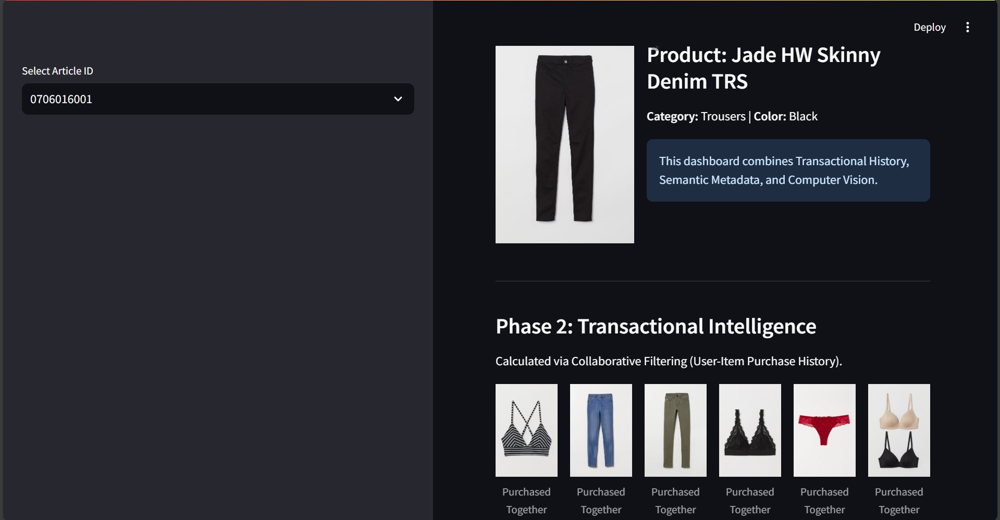
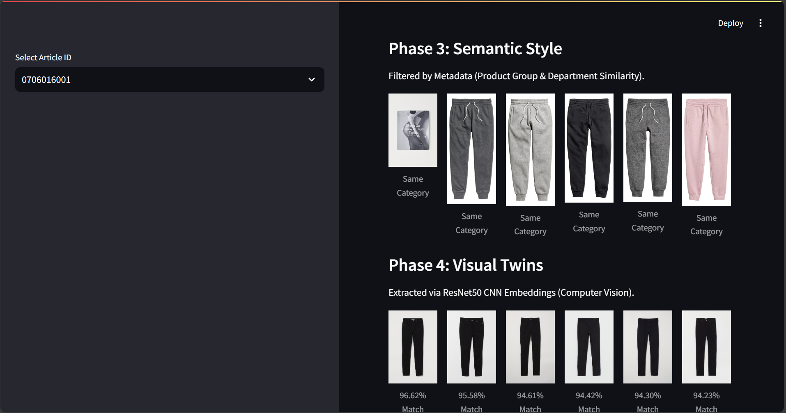

Multi-Modal Fashion Discovery Engine
A Hybrid Recommender System integrating Deep Learning and Big Data Optimization

Project Overview
This project develops an end-to-end recommendation engine using the H&M Personalized Fashion dataset (31M+ transactions). The system addresses the "Cold Start" problem by combining historical transaction patterns with Computer Vision to identify visually similar products.

Key Results
Improved Performance: Achieved a 3x improvement in MAP@12 (Mean Average Precision) compared to the popularity-based baseline.

Data Scalability: Optimized ETL pipelines using Polars, reducing memory overhead by 70% and accelerating data loading by 10x via Parquet conversion.

Technical Architecture
1. Data Engineering & Optimization
Parquet Conversion: Converted 3GB+ of raw CSV data into compressed Parquet files for high-speed I/O.

Temporal Splitting: Implemented a time-based validation split to simulate real-world "future" purchase predictions.

2. Multi-Modal Recommendation Logic
The engine utilizes a hybrid retrieval strategy:

Collaborative Filtering: Analyzes individual purchase history for repeat-purchase precision.

Content-Based Filtering: Uses article metadata (color, department, product type) for style matching.

Computer Vision: Leverages a pre-trained ResNet50 CNN to extract 2048-dimensional feature vectors (embeddings) from 100k+ images.

3. Visual Similarity Search
Using Cosine Similarity on the extracted Deep Learning embeddings, the system identifies "Visual Twins"—items that share structural and aesthetic similarities even if metadata is sparse.

Repository Structure
Plaintext

├── images/               # H&M Product Image dataset (0XX subdirectories)
├── app.py                # Streamlit Dashboard UI (Interactive Demo)
├── data_optim.py         # Polars-based ETL and Parquet optimization
├── split_data.py         # Temporal validation splitting logic
├── visual_features.py    # ResNet50 Feature Extraction pipeline
├── visual_reccs.py       # Cosine Similarity & Recommendation mapping
├── individual_baseline.py # Personalized purchase history logic
├── final.py              # Hybrid evaluation and MAP@12 scoring
└── .gitignore            # Configured to exclude heavy data/image files
Interactive Dashboard
The Streamlit UI provides a real-time interface for visual discovery. Users can input an Article ID to instantly view its "Visual Matches" generated by the Deep Learning layer.

How to Run
Initialize Data: Run data_optim.py to generate optimized .parquet files.

Extract Features: Run visual_features.py to generate the AI embeddings (visual_features.npy).

Launch UI: `python -m streamlit run app.py`